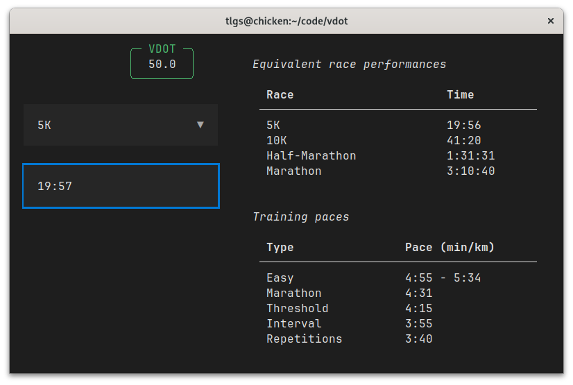

# vdot

Because I got nerdsniped by the intersection of running and math.

## What's this?

VDOT is a _system_ devised by Jack Daniels and Jimmy Gilbert
that aims to capture runners' physiological capabilities and
provide them with suitable workout intensity paces.
Based on a runner's recent race finish time,
it calculates _equivalent_ race times for other distances
and prescribes running paces for different types of workouts.

This is an exploration of the math and ideas behind the system.
Funnily enough, despite making an effort to keep its formula secret and
taking down 3rd party calculators, official tables
(_Daniels' Running Formula, 3rd edition_) contain errors and official
calculators prescribe non-sensical training paces for low values of VDOT (July 2023).

For a better introduction to VDOT I recommend picking up Daniels' books.
If you're looking for the official thing, you should take a look at
the [official calculator](https://vdoto2.com/).
However, if you are going down the rabbit hole of Running × Math,
I invite you to take a look at the [Jupyter notebooks](notebooks/) in this project.
